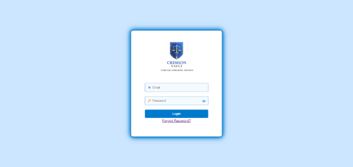
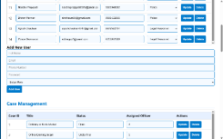
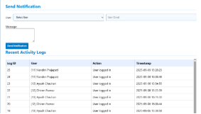
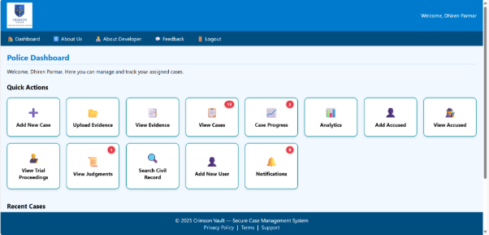
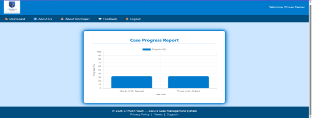
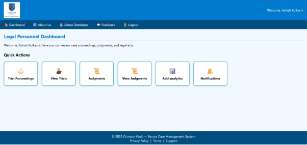
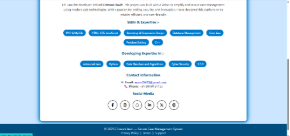

**Crimson Vault**

**Crimson Vault** is a secure, role-based web application for centralized management of civil, criminal, and cybercrime case records. It is designed for authorized law enforcement and judicial personnel, focusing on security, accountability, and workflow efficiency.

-----
**✨ Features**

- Role-based access (Admin, Police Officer, Legal Personnel)
- Multi-Factor Authentication (Email OTP)
- Secure case, evidence, and judgment management
- Encrypted evidence uploads
- Case progress tracking & analytics
- Predictive case insights & similar case detection
- Audit logs, notifications, and feedback system
-----
**🛠 Tech Stack**

**Frontend**

- HTML, CSS, JavaScript

**Backend**

- PHP

**Database**

- MySQL

**Security**

- AES-256 encryption
- OTP-based MFA
- Role-based permissions
-----
**📂 Core Modules**

- **Authentication** – Secure login, OTP verification, password reset
- **Case Management** – Create, update, track cases
- **Evidence Handling** – Encrypted document & media uploads
- **Legal Workflow** – Trial proceedings, judgments, analytics
- **Administration** – User management, audit logs, notifications
-----
**🗃 Database Design**

- Normalized schema (1NF → BCNF)
- Key tables: members, cases, evidence, accused, judgments,\
  trial\_proceedings, analytics, audit\_log, notifications
-----
**🚀 Getting Started**

**Prerequisites**

- PHP 8.x
- MySQL 8.x
- Apache / Nginx
- XAMPP or WAMP

**Local Setup**

git clone https://github.com/your-username/crimson-vault.git

1. Move project to htdocs
1. Import database (crimson\_vault.sql)
1. Configure database credentials
1. Start Apache & MySQL
1. Open http://localhost/crimson-vault
-----
**🧪 Testing**

- White-box and black-box testing completed
- Authentication, case workflow, analytics, and uploads validated
- All critical issues fixed; system stable
-----
**🔮 Future scope** 

- Advanced AI-based case prediction
- Mobile OTP support
- Detailed case milestone tracking
- External system integrations
- Mobile and offline access
-----
**👨‍💻 Author**

**Aumkumar H. Sheth**\
BCA – Web Application Development

-----
**📄 License**

This project is open for **educational and research purposes**.\
Commercial use requires permission.

-----
📷**Snapshots** 

